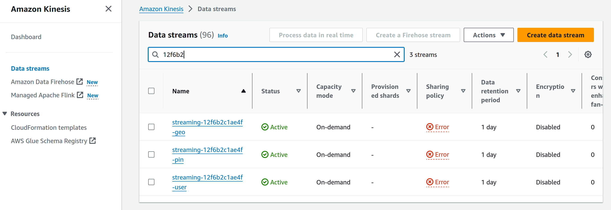

# Pinterest Data Pipeline

## Pipeline Architecture 


## Table of Contents
- [Pinterest Data Pipeline](#pinterest-data-pipeline)
  - [Pipeline Architecture](#pipeline-architecture)
  - [Table of Contents](#table-of-contents)
  - [Overview](#overview)
    - [Batch Processing](#batch-processing)
    - [Stream Processing](#stream-processing)
  - [EC2 Client Configuration](#ec2-client-configuration)
  - [AWS MSK Configuration](#aws-msk-configuration)
  - [Configure a REST API in API Gateway](#configure-a-rest-api-in-api-gateway)
  - [Configure REST proxy on EC2 client](#configure-rest-proxy-on-ec2-client)
  - [Data Processing on Databricks](#data-processing-on-databricks)
    - [Batch Processing: Databricks](#batch-processing-databricks)
    - [Stream Processing: Databricks](#stream-processing-databricks)

## Overview

> The purpose of this project is to build an end-to-end AWS-hosted data engineering pipeline, supporting both batch and stream processing using pinterest's experimental dataset.

### Batch Processing

- Extract the experimental data from an `RDS` database containing the 3 pinterest tables (`pinterest_data`, `geolocation_data` and `user_data`).
- Setup an `EC2` instance with `kafka` and `Kafka REST Proxy` installed to produce messages to `AWS MSK` cluster.
- Create an `S3` bucket to store data.
- Create an `AWS MSK` cluster with an `S3` endpoint to distribute data from a `REST API` to an `S3` Data Lake.
- Create 3 `kafka` topics corresponding to the 3 `RDS` tables.
- Create a `REST API` using `API Gateway` to send data via a `POST` request to 3 `kafka` topics. 
- Extract the batch data from S3 then clean & transform it in Databricks using spark queries.
- Create a DAG using `Airflow` and upload it a `AWS MWAA` environment to periodically trigger the Databricks notebook for batch processing.


### Stream Processing

- Create 3 `Kinesis` data streams corresponding to the 3 pinterest tables to collect, process, and analyze data streams in real time.
- Configure the previous `REST API` to allow it to invoke `Kineses` actions.
- Send data to the `Kinesis` streams using the `REST API`.
- Read the data from the `Kinesis` streams within a Databricks Notebook, create streaming dataframes for the each of the 3 `Kinesis` data streams and transform the data using spark queries.
- Write each stream to a `Delta Table`. 


## EC2 Client Configuration

- Step 1: Create an `EC2` instance.
  
  * On the AWS console create a `EC2` instance.
  * Create a `key-par` with a `.pem` file format, save it locally.
  * `SSH` into the `EC2` instance.

- Step 2: Install `kafka` on `EC2`.
  
  * If `java` is not installed, install it:
    * `sudo yum install java-1.8.0`
  
  * Download and install `kafka`:

    * `wget https://archive.apache.org/dist/kafka/2.8.1/kafka_2.12-2.8.1.tgz`
    * `tar -xzf kafka_2.12-2.8.1.tgz`

  * The `kafka_installation_folder` should now be visible in the /home directory.

- Step 3: Setup `IAM Authentication` on the `EC2` to produce messages to the `AWS MSK` cluster. This package is necessary to connect to `AWS MSK` clusters that require `IAM Authentication`.

  * Navigate to the `kafka_installation_folder/libs` directory and install the `IAM Authentication` package:
    * `wget https://github.com/aws/aws-msk-iam-auth/releases/download/v1.1.5/aws-msk-iam-auth-1.1.5-all.jar`

- Step 4: Configure the `EC2` kafka client to use AWS IAM.

    * Navigate to the `kafka_installation_folder/bin` and edit the `client.properties` file to include the `awsRoleArn` which can be found in the AWS console for the `IAM` that was created for this `EC2` instance:

      ```text
      # Sets up TLS for encryption and SASL for authN.
      security.protocol = SASL_SSL

      # Identifies the SASL mechanism to use.
      sasl.mechanism = AWS_MSK_IAM

      # Binds SASL client implementation.
      sasl.jaas.config = software.amazon.msk.auth.iam.IAMLoginModule required awsRoleArn="Your Access Role";

      # Encapsulates constructing a SigV4 signature based on extracted credentials.
      # The SASL client bound by "sasl.jaas.config" invokes this class.
      sasl.client.callback.handler.class = software.amazon.msk.auth.iam.IAMClientCallbackHandler
      ```
## AWS MSK Configuration

- Step 1: Create an `AWS MSK` cluster if not created and navigate to the `AWS MSK` dashboard on the AWS console to extract from the cluster:

  * `Bootstrap servers string`
  * `Plaintext Apache Zookeeper connection string`
  
- Step 2: On the `EC2` kafka client create 3 kafka topics (Be consistent with the naming schema).

  * A topic for `pinterest_data`
  * A topic for `geolocation_data` 
  * A topic for `user_data`

- Step 3: Create an `S3` bucket. Here all data passing through the kafka topics will be exported to the designated bucket.

- Step 4: Create a custom plugin.
  
  * This plugin will contain the code that defines the logic of our connector:
  
    ```text
    # assume admin user privileges
    sudo -u ec2-user -i
    # create directory where we will save our connector 
    mkdir kafka-connect-s3 && cd kafka-connect-s3
    # download connector from Confluent
    wget https://d1i4a15mxbxib1.cloudfront.net/api/plugins/confluentinc/kafka-connect-s3/versions/10.0.3/confluentinc-kafka-connect-s3-10.0.3.zip
    # copy connector to our S3 bucket
    aws s3 cp ./confluentinc-kafka-connect-s3-10.0.3.zip s3://<BUCKET_NAME>/kafka-connect-s3/
    ```

You should find the uploaded file within the `S3` bucket


- Step 5: Create a connector to write to the bucket.

    * Select the previously created plugin and configure the `Connector configuration settings` template below accordingly.

      ```text
      connector.class=io.confluent.connect.s3.S3SinkConnector
      # same region as our bucket and cluster
      s3.region=us-east-1
      flush.size=1
      schema.compatibility=NONE
      tasks.max=3
      # include nomenclature of topic name, given here as an example will read all data from topic names starting with msk.topic....
      topics.regex=<YOUR_UUID>.*
      format.class=io.confluent.connect.s3.format.json.JsonFormat
      partitioner.class=io.confluent.connect.storage.partitioner.DefaultPartitioner
      value.converter.schemas.enable=false
      value.converter=org.apache.kafka.connect.json.JsonConverter
      storage.class=io.confluent.connect.s3.storage.S3Storage
      key.converter=org.apache.kafka.connect.storage.StringConverter
      s3.bucket.name=<BUCKET_NAME>
      ```

## Configure a REST API in API Gateway

- Step 1: Create a REST API via `API Gateway` with a proxy resource. By creating a proxy resource with the {proxy+} parameter and the ANY method, you can provide your integration with access to all available resources.


- Step 2: For the proxy resource, create a HTTP ANY method. For the Endpoint URL, it should include the public ipv4 DNS of the `EC2` kafka client with the following format: http://KafkaClientEC2InstancePublicDNS:8082/{proxy} 

- Step 3: Deploy the API and make note of the `Invoke URL`.
  
## Configure REST proxy on EC2 client
The endpoint URL
- Step 1: Install confluent REST:
  
  * `sudo wget https://packages.confluent.io/archive/7.2/confluent-7.2.0.tar.gz`
  * `tar -xvzf confluent-7.2.0.tar.gz`

- Step 2: Modify the `kafka-rest.properties` file.
    
    * Navigate to `confluent-7.2.0/etc/kafka-rest` and modify the `kafka-rest.properties` file similar to the `client.properties` file, however this time add "client." before each of the 4 variables. To allow communication between the REST proxy and the cluster brokers, all configurations should be prefixed with "client.". 
    
    * Modify the `zookeeper.connect` and `bootstrap.severs` variables in the file, these were obtained during the [AWS MSK Configuration](#aws-msk-configuration) section.
  
- Step 4: Messages can now be produced to the kafka cluster by navigating to the `confluent-7.2.0/bin` directory and running:

  `./kafka-rest-start /home/ec2-user/confluent-7.2.0/etc/kafka-rest/kafka-rest.properties`

- Step 5: Run the [Batch Data Script](./user_posting_emulation.py). This script sends data from the 3 tables to their corresponding Kafka topics. Data passing through the `AWS MSK` cluster should be falling into the `S3` bucket.


## Data Processing on Databricks

Using Databricks, we can provision a cluster running `Apache Spark` to run spark queries for data transformations. See [Batch Processing Notebook](./Databricks_Notebooks/batch_processing_databricks.ipynb) and [Stream Processing Notebook](./Databricks_Notebooks/stream_processing_databricks.ipynb) for a comprehensive guide.

### Batch Processing: Databricks

- Step 1: Create a [Databricks Notebook](./Databricks_Notebooks/batch_processing_databricks.ipynb) for batch processing and read the `AWS Credentials` that have been uploaded to a Databricks `Delta Table` and mount the `S3` bucket to Databricks.
  
    ```python
    aws_keys_df = spark.read.format("delta").load(delta_table_path)
    # Get the AWS access key and secret key from the spark dataframe
    ACCESS_KEY = aws_keys_df.select('Access key ID').collect()[0]['Access key ID']
    SECRET_KEY = aws_keys_df.select('Secret access key').collect()[0]['Secret access key']
    
    # Mount the drive (RUN ONLY ONCE!)
    # dbutils command is supported only with databricks ecosystem.
    dbutils.fs.mount(SOURCE_URL, MOUNT_NAME)
    ```

- Step 2: Data cleaning. Performing necessary transformations of the dataframes. Example using the `pinterest_data` dataframe.
  
    ```python
    df_pin = df_pin.withColumn("description", when(col("description").contains("No description available"), "None").otherwise(col("description")))
    df_pin = df_pin.withColumn("image_src", when(col("image_src").contains("Image src error"), "None").otherwise(col("image_src")))
    df_pin = df_pin.withColumn("follower_count", when(col("follower_count").contains("User Info Error"), "None").otherwise(col("follower_count")))
    df_pin = df_pin.withColumn("follower_count", regexp_replace(df_pin["follower_count"], "M", "000000"))
    df_pin = df_pin.withColumn("follower_count", regexp_replace(df_pin["follower_count"], "k", "000"))
    df_pin = df_pin.withColumn("downloaded",col("downloaded").cast("int"))
    df_pin = df_pin.withColumn("follower_count",col("follower_count").cast("int"))
    df_pin = df_pin.withColumn("index",col("index").cast("int"))
    df_pin = df_pin.withColumnRenamed("index","ind")

    df_pin = df_pin.select("ind", "unique_id", "title", "description", "follower_count", "poster_name", "tag_list", "is_image_or_video", "image_src", "save_location", "category")
    ```


- Most popular annual category:

    ```python
    result= spark.sql("""SELECT 
                            post_year, category, category_count
                        FROM (
                            SELECT 
                                year(timestamp) as post_year, category, count(*) as category_count,
                                DENSE_RANK() OVER (PARTITION by year(timestamp) ORDER BY count(*) DESC) AS ranking
                            FROM geo
                            JOIN pin 
                            ON geo.ind = pin.ind
                            GROUP BY year(timestamp), category
                        )
                        where ranking = 1"""
                    )

    display(result)
    ```


- Most popular category based on age group:

    ```python
    result = spark.sql("""WITH CTE AS (
                        SELECT 
                            age_group, category, category_count,
                            DENSE_RANK() OVER (PARTITION BY age_group ORDER BY category_count DESC) AS ranking
                        FROM (
                            SELECT
                                CASE 
                                    WHEN age BETWEEN 18 AND 24 THEN "18-24"
                                    WHEN age BETWEEN 25 AND 35 THEN "25-35"
                                    WHEN age BETWEEN 36 AND 50 THEN "36-50"
                                    WHEN age > 50 THEN "50+"
                                    --ELSE "NONE" 
                                END AS age_group,
                                category,
                                COUNT(*) AS category_count
                            FROM user
                            JOIN pin ON pin.ind = user.ind
                            GROUP BY age_group, category
                        )
                    )
                    
                    SELECT 
                        age_group, category, category_count
                    FROM CTE
                    WHERE ranking = 1"""
                )

    display(result)
    ```


- Step 3: Create a DAG using `Airflow` and upload it a `AWS MWAA` environment to periodically trigger the Databricks notebook for batch processing. See [Airflow DAG](./airflow/12f6b2c1ae4f_dag.py)


### Stream Processing: Databricks

- Step 1: Navigate to the AWS `Kinesis` dashboard on the AWS console and select `Kinesis` Data Streams. Create 3 data streams, one for each table. 



- Step 2: Configure the [REST API](#configure-a-rest-api-in-api-gateway) created in the previous steps to allow for `Kinesis Proxy integration. Under the streams resource create a new child resource with the Resource name {stream-name}. The configuration should look like this:


- Step 3: Run the [Streaming Data Script](./user_posting_emulation_streaming.py). This script sends a `PUT` requests to the API, which adds one record at a time to the 3 `Kinesis` streams, one for each pinterest table.

- Step 4: Create a [Databricks Notebook](./Databricks_Notebooks/stream_processing_databricks.ipynb) for stream processing and read the `AWS Credentials` that have been uploaded to a Databrick Delta Table.

- Step 5: Create a `streaming dataframe` for structured streaming events by reading in the data from `Kinesis` streams.
  
    * Example: Use the `readstream` method to create a dataframe for the pinterest data stream.

      ```python
      df_pin = spark \
      .readStream \
      .format('kinesis') \
      .option('streamName','streaming-12f6b2c1ae4f-pin') \
      .option('initialPosition','earliest') \
      .option('region','us-east-1') \
      .option('awsAccessKey', ACCESS_KEY) \
      .option('awsSecretKey', SECRET_KEY) \
      .load()
      ```

- Step 6: Define the streaming schema for the 3 data streams.
    
    * A schema can be defined using the `StructType` and `StructField` classes, as well as related classes from the `pyspark.sql.types` module.

      ```python
      streaming_schema = StructType([
      StructField("field1", StringType(), True),
      StructField("field2", IntegerType(), True),
      StructField("field3", TimestampType(), True),
      # Add more fields as needed
      ])
      ```

- Step 7: Data cleaning. Performing necessary transformations of the dataframes as done in the [Batch Processing: Databricks](#batch-processing-databricks) section.

- Step 8: Write the streams to a Databricks `Delta Table`.

    * Example: Use the `writestream` method to store the pinterest data stream to a `Delta Table`.

      ```python
      df.writeStream \
      .format("delta") \
      .outputMode("append") \
      .option("checkpointLocation", "/tmp/kinesis/_checkpoints/") \
      .table("<TABLE_NAME>")
      ```

You should be able to see the created table, its schema and the streaming data that has been stored inside it.


- Sample Data from the pinterest post stream.

